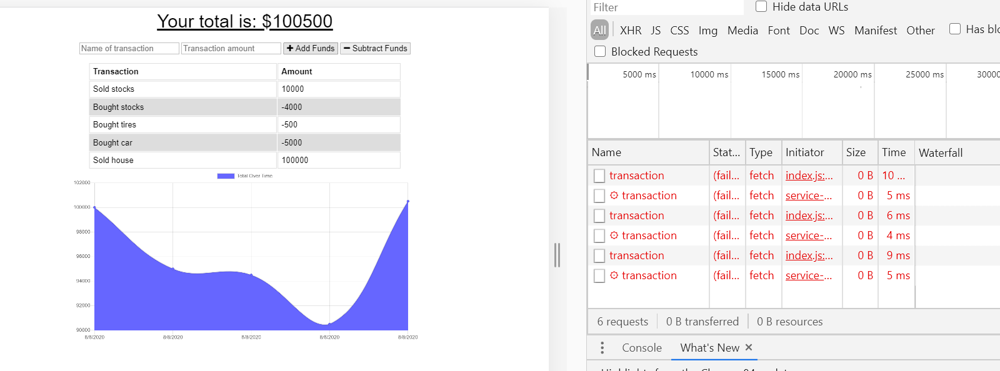
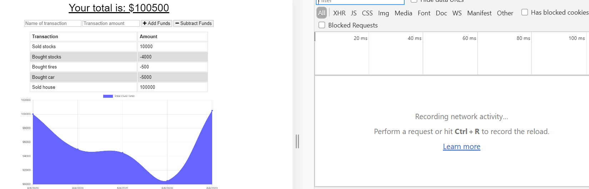

# PWA Budget Tracker

## Description

Giving users a fast and easy way to track their money is important, but allowing them to access that information anytime is even more important. Therefore, having offline functionality is paramount to our applications success. This budget tracker utilizes PWA practices to allow for offline access and functionality.

## Features

The user will be able to add expenses and deposits to their budget with or without a connection. When entering transactions offline, they should populate the total when brought back online.

  * Enter deposits offline

  * Enter expenses offline

  * Offline entries should be added to tracker when brought back online

## User Story
```
AS AN avid traveller
I WANT to be able to track my withdrawals and deposits with or without a data/internet connection
SO THAT my account balance is accurate when I am traveling
```
## Installation and Usage

For local host, simply run `npm install` and then `npm start` to run server on local host.

## Screenshots + Instructions

1. First, navigate to the deployed link and open the website. Then, turn off wifi or go offline. Enter your entries into the budget tracker.



2. After entries are done, turn on Wifi (get online) and exit and reopen the link. The entries that were entered offline will appear online now. 

